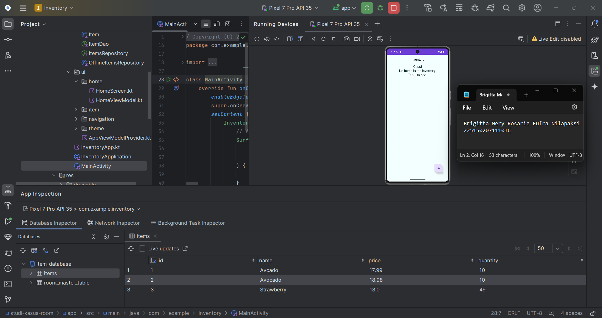

# Nama Proyek

Setelah mengikuti semua langkah dalam codelab, aplikasi berhasil dijalankan dengan baik. Saya menambahkan beberapa data ke dalam database dan memeriksa hasilnya pada tabel `items`. Untuk memastikan bahwa penambahan data berhasil, Anda dapat membuka tab **App Inspection** di Android Studio.

Seperti yang terlihat pada gambar di atas, terdapat 3 data baru yang telah ditambahkan. Ini menandakan bahwa implementasi **Room Database** telah berhasil dilakukan.
